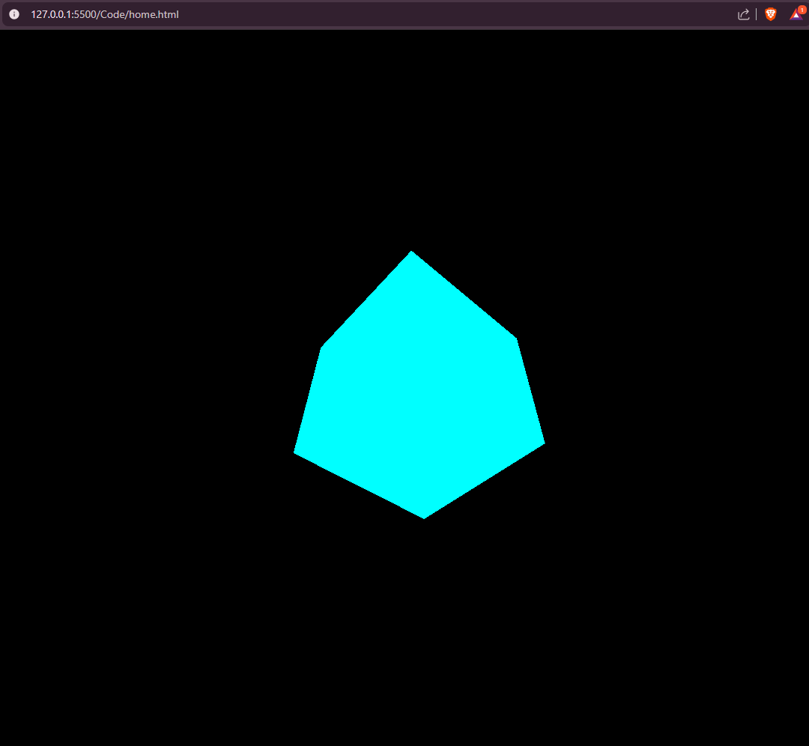

# 3D-Cube-Rotating
>Renders a 3D rotating cube in the browser using Three.js via CDN for demonstration purposes.
---

## 📖 Table of Contents
- [About](#about)
- [Features](#features)
- [Installation](#installation)
- [Usage](#usage)
- [Screenshot](#screenshots--demo)
- [Technologies](#technologies)
- [Acknowledgements](#acknowledgements)
- [Contributing](#contributing)

---

## 🔍 About
This uses CDN version 0.180.0
It's for testing the performance of different browsers rendering a simple 3D object that rotates along the x and y axis.  

---

## ✨ Features
- 🎨 Interactive 3D animations
- 📱 Responsive design
- 🌍 Works on modern browsers
- ⚡ Fast and lightweight

---

## ⚙️ Installation
No installation is required. Simply clone the repo if you want a local copy.

```bash
Clone the repo:
git clone https://github.com/Net-Runner-Syndrome/3D-Cube-Rotating.git

```

---

## ⚙️ Usage
Simply open `index.html` in your browser.

---

## 📸 Screenshot


---

## 🛠️ Technologies
- Three.js
- HTML5 / CSS3 / JavaScript
- Node.js

---

## 🙌 Acknowledgements
[Three.js Documentation](https://threejs.org/manual/#en/installation)

## 🌍 Contributing
Contributions are welcome! Please open an issue or submit a pull request
